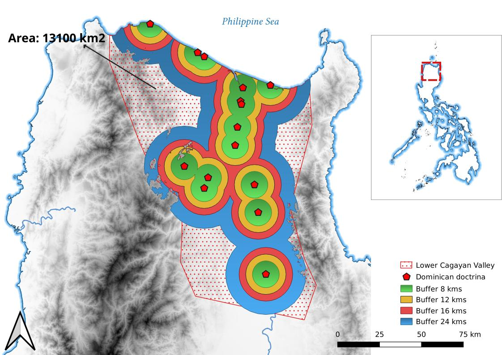

This repository contains scripts and data for the paper 'Missionaries,
rivers and inundation. GIS and early modern religious globalization'
presented by me at the [Digital-History-Tagung
2023](https://dhistory.hypotheses.org/digital-history-tagung-2023).

The code is released under the [GNU General Public License version
3.0](https://www.gnu.org/licenses/gpl-3.0.html). 

